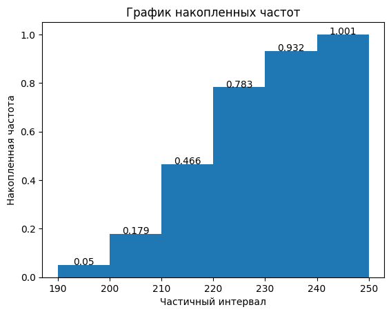
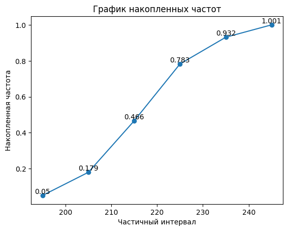

# statistics-homework-1

## tast 1
Пусть число опечаток в книге объёмом 100 страниц описывается распределением Пуассона, в среднем на 10 страниц встречается 2 опечатки.

1. Найдите вероятность того, что на случайно выбранной странице будет не более одной опечатки.
2. Найдите вероятность того, что на случайно выбранной странице будет хотя бы 3 опечатки
3. Найдите математическое ожидание и дисперсию числа опечаток на всей книге.
4. Предположим, что корректор утверждает, что в книге не более 10 ошибок. Найдите вероятность такого события

### solution
Пусть $\xi$ - число опечаток в книге объемом 100 страниц. Тогда $\xi \sim Poiss(\lambda)$, где среднее значение будет равно $\lambda = 2*10 = 20$, потому что каждый 10 страниц можно считать независимыми и складывать их распределения.

Вероятность в распределении Пуассона находится по формуле $P(\xi = m)=\frac{\lambda^m}{m!}*e^{-\lambda}$.

$\psi$ - число опечаток на 1 странице. $\psi \sim Poiss(0.2)$.

#### 1.1
Вероятность того, что на странице будет не боллее 1 опечатки равна сумме вероятностей, что на странице 1 или 0 опечаток.

``` Python
import math
def poiss(l, m):
    return (l**m)/(math.factorial(m))*math.e**(-l)
```  

$$P(\xi = 0) + P(\xi = 1)=\frac{0.2^0}{0!}*e^{-0.2} + \frac{0.2^1}{1!}*e^{-0.2} = 0.8187307530779818+ 0.1637461506155964 = 0.9824769036935782$$

#### 1.2
Вероятность того, что будет совершено 3 и больше ошибок можно найти через дополнение. Из 1 вычесть вероятность совершения 2 и менее ошибок.

$$P(\xi >= 3) = 1 - P(\xi <=2) = 1 - P(\xi = 2) - P(\xi = 1) - P(\xi = 0)$$

$$P(\xi = 0) + P(\xi = 1) + P(\xi = 1)=\frac{0.2^0}{0!}*e^{-0.2} + \frac{0.2^1}{1!}*e^{-0.2} + \frac{0.2^2}{2!}*e^{-0.2}= 0.8187307530779818+ 0.1637461506155964 + 0.016374615061559638 = 0.9988515187551379$$

$$1 - P(\xi = 2) - P(\xi = 1) - P(\xi = 0) = 0.0011484812448621096$$

#### 1.3
Математическое ожидание и дисперсия по всей книге.

$$E\xi = \lambda = 20$$

$$Var\xi = \lambda = 20$$

#### 1.4 
Вероятность, что в книге 10 и менее ошибок

$$P(\xi <= 10) = P(\xi = 9) + P(\xi = 8) + P(\xi = 7) + P(\xi = 6) + P(\xi = 5) + P(\xi = 4) + P(\xi = 3) + P(\xi = 2) + P(\xi = 1) + P(\xi = 0) = 0.010811718826652736$$

``` Python
total = 0
for m in range(0, 11):
    total += poiss(20, m)
```


## task 2

В типографии печатные страницы проходят автоматическую проверку на орфографические ошибки. По статистике, каждая третья страница содержит ошибки. Машина собирает страницы без ошибок для отправки в печать.

Сколько страниц в среднем нужно просмотреть, чтобы с вероятностью не менее 0.95 собрать не менее 120 страниц без ошибок?

### solution

Вероятность встретить ошибку на странице $P(ошибка) = \frac{1}{3}$. Вероятность, что страница будет без ошибок $P(нет-ошибки) = \frac{2}{3} = p$

Это биномиальное распределение. Нужно понять, сколько опытов провести, чтобы с вероятностью не менее 95% получить 120 положительных исходов (страниц без ошибки).

Случайная величина $\xi$ - количество старниц без ошибок. Надо найти $n$, чтобы вероятность $P(\xi = 120) >= 0.95$.

$$P(\xi=120) = C_{n}^{120}*p^{120}*(1-p)^{n-120} = \frac{n!}{120!(n-120)!}*p^{120}*(1-p)^{n-120} >= 0.95$$

Такое решить сложно. Поэтому при больших n биномиальное распределение можно приблизить нормальным, где 

$$\mu = np$$

$$\sigma = \sqrt{np(1-p)}$$

Если сделать z-преобразование, то можно будет воспользоваться функцией Лапласа

$$Z = \frac{\xi - \mu}{\sigma} = \frac{\xi - np}{\sqrt{np(1-p)}}$$

$$P(a\leqslant Z \leqslant b) = \Phi(b) - \Phi(a)$$

Тогда надо над 120 также сделать z-преобразование.

$$a= \frac{120 - \mu}{\sigma} = \frac{120 - np}{\sqrt{np(1-p)}}$$

$$P(Z\geqslant a) = \Phi(\infty) - \Phi(a) = 0.5 - \Phi(a) = 0.95$$

Получаем, что

$$\Phi(-a) = \Phi(\frac{np - 120}{\sqrt{np(1-p)}})= 0.45$$

По таблице функции Лапласа находим, что это будет при значении аргумента равном $1.97$

$$\frac{np-120}{\sqrt{np(1-p)}}=\frac{n*\frac{2}{3} -120}{\sqrt{n*\frac{2}{9}}}=1,97$$

Получится квадратное уравнение 

$$n=200$$

## task 3

В среднем 10% работоспособного населения некоторого региона - безработные. Оценить с помощью неравенства Чебышева вероятность того, что уровень безработицы среди случайно выбранных 10000 работоспособных жителей составит от 9% до 11%.

### solution

Неравенство Чебышева

$$P(|\xi - \mu|\geqslant \epsilon) \leq \frac{\sigma^2}{\epsilon^2}$$

Где

$\mu$ - математическое ожидание

$\sigma^2$ - дисперсия

$\epsilon$ - отклонение от среднего

В этой задаче $\xi$ - случайная величина, количество безработных.

$\mu=10000*10\% = 1000$

$\epsilon = 10000*1\% = 100$

$$P = P(|\xi-\mu|\leq \epsilon) \geq 1-\frac{\sigma^2}{\epsilon^2} $$


$$P \geq 1 - \frac{\sigma^2}{10000}$$

Дисперсия по условию не известна, поэтому ответ с параметром.


## task 4

Результаты исследования прочности 200 образцов материала на сжатие представлены в виде интервального статистического ряда:

| Номер i | Частичный интервал | Число наблюдений, попавших в интервал, $n_i$ |
| ------- | ------------------ | -------------------------------------------- |
| 1       | 190-200            | 10                                           |
| 2       | 200-210            | 26                                           |
| 3       | 210-220            | 58                                           |
| 4       | 220-230            | 64                                           |
| 5       | 230-240            | 30                                           |
| 6       | 240-250            | 14                                           |


Построить гистограму и график накопленных частот

### solution

``` Python
from functools import reduce
import matplotlib.pyplot as plt

count_observ_n = [10, 26, 58, 64, 30, 14]
N = sum(count_observ_n)
frequency_wi=[]
for n in count_observ_n:
    frequency_wi.append(round(n/N,3))

cummul_freq = [round(reduce(lambda x,y: x+y, frequency_wi[:i], 0), 3) for i in range(1,len(frequency_wi)+1)]
```

| Номер i | Частичный интервал | Число наблюдений, попавших в интервал, $n_i$ | $\omega_i$ - частота | $w_{i}^{c}$-накопленная частота |
| ------- | ------------------ | -------------------------------------------- | -------------------- | ------------------------------- |
| 1       | 190-200            | 10                                           | 0.05                 | 0.05                            |
| 2       | 200-210            | 26                                           | 0.129                | 0.179                           |
| 3       | 210-220            | 58                                           | 0.287                | 0.466                           |
| 4       | 220-230            | 64                                           | 0.317                | 0.783                           |
| 5       | 230-240            | 30                                           | 0.149                | 0.932                           |
| 6       | 240-250            | 14                                           | 0.069                | 1                               |

``` Python
middle_ranges = [195,205,215,225,235,245]
fix, ax = plt.subplots()
ax.bar(middle_ranges, cummul_freq, width = 10,align='center')
ax.set_xlabel('Частичный интервал')
ax.set_ylabel('Накопленная частота')
```

Гистограмма накопленных частот:




``` Python
fix, ax = plt.subplots()
bars = ax.plot(middle_ranges, cummul_freq, marker='o')
ax.set_xlabel('Частичный интервал')
ax.set_ylabel('Накопленная частота')
ax.set_title('График накопленных частот')

for x,y in zip(middle_ranges, cummul_freq):
    ax.text(x,y+0.01, str(y), ha='center')

```

График накопленных частот




## task 5